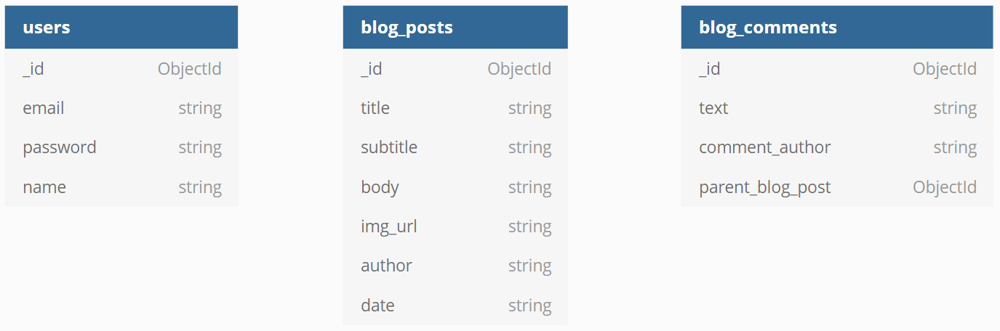
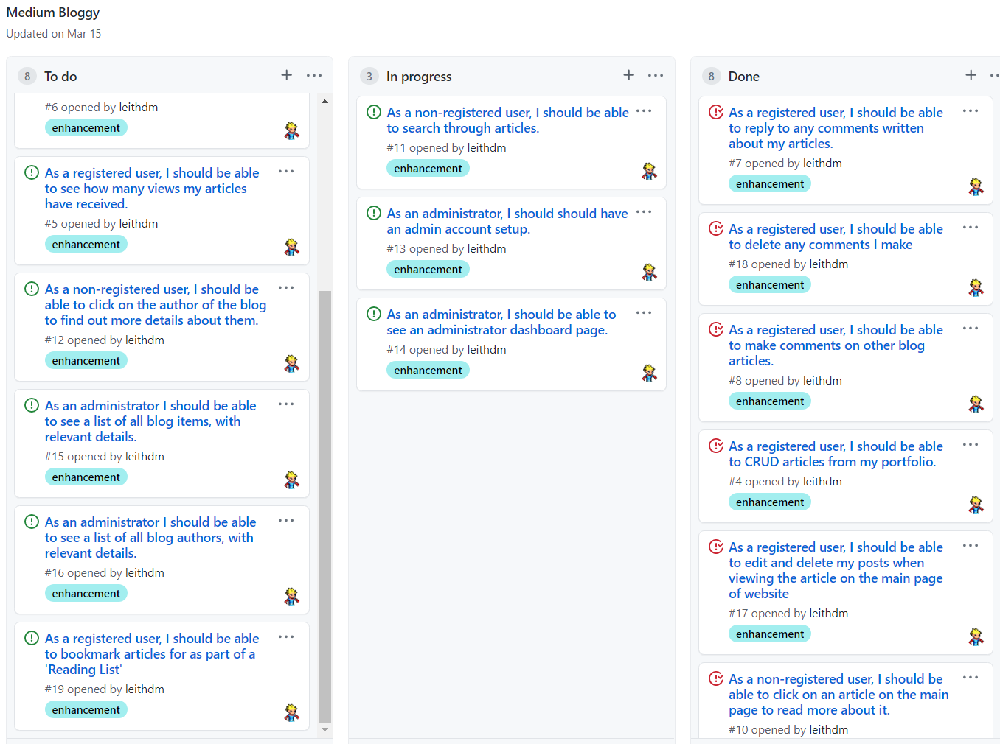

- [Overview](#overview)
- [UX](#ux)
  - [User Stories](#user-stories)
  - [Design](#design)
    - [Frameworks](#frameworks)
    - [Color Scheme](#color-scheme)
    - [Icons](#icons)
    - [Typography](#typography)
  - [Wireframes](#wireframes)
  - [Schema](#schema)
- [Features](#features)
  - [Existing Features](#existing-features)
  - [Future Features](#future-features)
- [Technologies Used](#technologies-used)
  - [Front-End Technologies](#front-end-technologies)
  - [Back-End Technologies](#back-end-technologies)
    - [Flask](#flask)
    - [Heroku](#heroku)
    - [Python](#python)
- [Agile Project Management](#agile-project-management)
- [Testing](#testing)
- [Deployment](#deployment)
- [Credits](#credits)
  - [Media](#media)
  - [Acknowledgments](#acknowledgments)

<br/>

---

## Overview

Medium Bloggy is a site for amateur bloggers and writers to show-case their work. You can view the deployed site 
[here](http://mediumbloggy.herokuapp.com/). 
The title of this site i.e *'Medium Bloggy'* is a homage to the [Medium.com](https://medium.com/) website, 
upon which this site is loosely based. 
This site is an example of [social journalism](https://en.wikipedia.org/wiki/Social_journalism), which relies heavily 
on community involvement and engagement in order to create the content. 

<br/>

### User Stories

- User Stories were written from the perspective of x2 different user(s):
    - the non-registered user that wants to read blog articles, without contributing content. 
    - the registered user that wants to write blog articles or comment on other articles.

<br/>

"**__As a *non-registered user*, I__** ______________________________________________"

- should be presented with blog articles on the main page. 
- should be able to click on an article on the main page to read more about it. 
- should be able to search through articles.
- should be able to register an account with the site in order to publish articles, and comment on them. 

<br/>

"**__As a *registered user*, I__** ______________________________________________"

- should be able to login to the site in order to publish articles. 
- should be presented with a profile page showing all of my posts. 
- should be able to update and delete posts from my profile page.
- should be able to create comments on any other posts.   
- should be able to delete comments that I have made.
- should be able to logout of my account. 

<br/>

### Design

- The overall concept was to emulate a *printed newspaper* by having a minimalist black and white color scheme, with a 
  modern sans serif typography. 

<br/>

#### Frameworks

- [StartBootstrap](https://startbootstrap.com/) provide a free Bootstrap template called 
  ['Clean-Blog'](https://startbootstrap.com/previews/clean-blog). This template was used to provide an initial style 
  and coloring to the site. By the end of the project practically all of the template code was replaced with my own 
  custom code.
- [Flask 1.1](https://flask.palletsprojects.com/en/1.1.x/) is a micro-framework that is used to render the back-end 
  Python with front-end Bootstrap. 

<br/>

#### Color Scheme

In keeping with the *printed newspaper* theme, minimalist colors are employed. 

-  `#212529` body text and background
-  `#868e96` block quotes
-  `#ffa500` main page jumbotron
-  `#0085A1` hover

<br/>

#### Icons

- [Font Awesome 5.6.1](https://fontawesome.com/) icons are used for the social media links, and the quotes in the 
footer.

<br/>

#### Typography

- [Google Fonts](https://fonts.google.com/) were used across the site, namely:
  - [Lora](https://fonts.google.com/specimen/Lora) - for body text.   
  - [Open Sans](https://fonts.google.com/specimen/Open+Sans) - for headings. 

<br/>

### Wireframes

- Wireframes were created using [Balsamiq Wireframes](https://balsamiq.com/) and can be viewed by clicking on links 
  below.

<br/>


|    Home Page   |    Registration Page     |    Login Page    |    Individual Post    |    Profile Page    
|    :----:      |    :----:                |    :----:        |    :----:             |    :----:        |
|[Desktop/Mobile](wireframes/main.png)|[Desktop/Mobile](wireframes/registration.png)|[Desktop/Mobile](wireframes/login.png)|[Desktop/Mobile](wireframes/post.png)|[Desktop/Mobile](wireframes/profile.png)

<br/>


### Schema

The database consists of x3 collections, which we can represent as follows:




---

## Features

### Existing Features
  - **Register Account:** Anybody can register for free and create their own unique account. I have built-in 
    authentication and authorization to check certain criteria is met before an account is validated. All passwords 
    are hashed for security purposes.
  - **Log In to Account:** For existing users, I have more authentication and authorization incorporated to check 
    that the hashed passwords and username match the database.
  - **Log Out of Account:** Users can easily log out of their account by clicking the logout button. 
  - **View All Posts:** On the *index* page, all blog posts are initially displayed, based on date of submission. 
  - **Search Posts:** The user can search for a relevant blog post, searched by Title or Subtitle. 
  - **CRUD Posts:** A registered user can create, read, update and delete their blog posts. By leveraging 
    [Flask-CKEditor](https://flask-ckeditor.readthedocs.io/en/latest/) it made it possible for users to add rich
    content to their blog posts like images, code syntax highlighting, etc. There are also lost of features in-built
    into the editor including spell-checking, linking, table insertion, font-styling, etc. All of these features make
    it intuitive for the user to create great blog posts. 
  - **CRD Comments:** A registered user can create, read, and delete comments made on any post. Again, commenting
    makes use of the CKEditor, allowing the user to create rich, well-presented content. 
  - **Random Quote Generator:** As this is a blogging site, I thought it would be a nice feature for the user to see 
    a random quote for further inspiration. The quote is located in the footer, and a fresh one is retrieved on loading
    the page. 

<br/>

### Future Features
A full list of future features **can be viewed in the 
[Product Backlog](https://github.com/leithdm/milestone-project-3/projects/1)**, but we will briefly mention some 
of them here:
-  **Pagination:** the ability to paginate blog-post search results.
-  **Bookmark:** the ability for a user to bookmark articles as part of a 'Reading List'.
-  **Administrator Dashboard:** the ability to login as an admin and have full oversight on content. 

<br/>

---

## Technologies Used

- [PyCharm](https://www.jetbrains.com/pycharm/) - used as the primary IDE.
- [GitHub](https://github.com/) - used for remote storage of code.
- [TinyPNG](https://tinypng.com/) - used to optimize (.jpg, .png) images for faster loading.
- [Balsamiq](https://balsamiq.com/) - used to create the project's wireframes.

### Front-End Technologies

- [HTML5](https://en.wikipedia.org/wiki/HTML5) - used to provide content and structure.
- [CSS3](https://en.wikipedia.org/wiki/Cascading_Style_Sheets) - used to provide styling.
- [JavaScript ES6](https://developer.mozilla.org/en-US/docs/Web/JavaScript)
- [Google Fonts](https://fonts.google.com/) - used to provide font styling.
- [Am I Responsive?](http://ami.responsivedesign.is/) - used to show site responsiveness.

### Back-End Technologies

#### Flask
- [Flask 1.1](https://flask.palletsprojects.com/en/1.1.x/) - used as a web micro-framework. 
- [Flask-WTF 0.14.3](https://flask-wtf.readthedocs.io/en/stable/) - for integrating Flask and 
  [WTForms](https://wtforms.readthedocs.io/en/2.3.x/). 
- [Flask-Bootstrap 3.3.7.1](https://pythonhosted.org/Flask-Bootstrap/) - packages Bootstrap into an easy-to-use 
  extension.
- [Flask-CKEditor 0.4.4.1](https://flask-ckeditor.readthedocs.io/en/latest/) - CKEditor integration for Flask. 

#### Heroku
- [Heroku](https://www.heroku.com/) - to host the site.
  
#### Python
- [Python 3.9](https://www.python.org/downloads/release/python-390/) - back-end programming language. 
- [MongoDB Atlas](https://www.mongodb.com/cloud/atlas2) - to store database in the cloud. 
- [PyMongo 3.11.2](https://pymongo.readthedocs.io/en/stable/) - Python API for working with MongoDB.

<br/>

---

## Agile Project Management

[GitHub Projects](https://github.com/features/project-management/) was used to iteratively sprint through the 
development of this app. Each *User Story* became an individual *Issue*, and was placed in a Kanban board composed of 
the following columns:
1. **Backlog** - all user stories, ordered by value/priority.
2. **Sprint** - a subset of user stories to be completed in a x1 week sprint.
3. **In Progress** - user stories currently being worked on from current sprint.
4. **Done** - user stories completed, and tested.

Along with tracking user stories, Github Projects was also used to track bugs. **The full list of user stories/bugs 
can be viewed [here](https://github.com/leithdm/medium-bloggy/projects/2).**



<br/>

---

## Testing

The testing process can be viewed [here](TESTING.md).

<br/>

---

## Deployment

**Local Deployment**

In order to run this project locally on your own system, you will need the following installed:

- [Python3](https://www.python.org/downloads/) to run the application.
- [PIP](https://pypi.org/project/pip/) to install all app requirements.
- Any IDE such as Microsoft [Visual Studio Code](https://code.visualstudio.com/).
- [GIT](https://git-scm.com/) for cloning and version control.
- [MongoDB](https://www.mongodb.com/) to develop your own database either locally or remotely on MongoDB Atlas.

Next, there's a series of steps to take in order to proceed with local deployment:

- Clone this GitHub repository by either clicking the green Clone or download button and downloading the project as a 
  zip-file (remember to unzip it first), or by entering the following into the Git CLI terminal:

`git clone https://github.com/leithdm/medium-bloggy.git`

- Navigate to the correct file location after unpacking the files.

`cd <path to folder>`

Create a `env.py` file with the relevant credentials. See the sample env.py file below, for example:


```
import os

os.environ.setdefault("MONGO_URI", "YOUR_MONGO_URI")

os.environ.setdefault("MONGO_DBNAME", "YOUR_MONGO_DBNAME")

os.environ.setdefault("SECRET_KEY", "YOUR_SECRET_KEY")

os.environ.setdefault("IP", "YOUR_IP")

os.environ.setdefault("PORT", "YOUR_PORT")

```

- Install all requirements from the requirements.txt file using this command:

`sudo -H pip3 -r requirements.txt`

- Sign up for a free account on [MongoDB](https://www.mongodb.com/) and create a new Database called `blog`. 
  The Collections in that database should be as follows:

**blog_comments**

```
_id: <ObjectId>
text: <string>
comment_author: <string>
parent_post: <ObjectId>

```

**blog_posts**

```
_id: <ObjectId>
title: <string>
subtitle: <string>
body: <string>
img_url: <string>
author: <string>
date: <string>
```

**users**

```
_id: <ObjectId>
email: <string>
password: <string>
name: <string>
```

- You should now be able to launch your app using:

`flask run`

- The site should be running on `localhost` on an address similar to `http://127.0.0.1:5000`.
<br/>

**Remote Deployment:**

This site is currently deployed on Heroku using the master branch on GitHub. To implement this project on Heroku, 
the following steps were taken:

1. Create a **requirements.txt** file so [Heroku](https://www.heroku.com/) can install the required dependencies to run 
   the app.

`sudo pip3 freeze --local > requirements.txt`

2. Create a **Procfile** to tell Heroku what type of application is being deployed, and how to run it.

`echo web: python run.py > Procfile`

3. Sign up for a free Heroku account, create your project app, and click the **Deploy** tab, at which point you can 
   *Connect GitHub* as the Deployment Method, and select *Enable Automatic Deployment*.

4. In the Heroku **Settings** tab, click on the *Reveal Config Vars* button to configure environmental variables 
   as follows:

```
IP : 0.0.0.0
MONGO_DBNAME: <your_MongoDB_name>
MONGO_URI : <link_to_your_MongoDB>
PORT : 5000
SECRET_KEY : <your_secret_key>
```
5. Your app should be successfully deployed to Heroku. 

<br/>

---

## Credits

### Media

- Pictures used on this site were obtained from [Unsplash](https://unsplash.com/). 
  Credit goes to the following photographers: 
  [Alex Block](https://unsplash.com/photos/oH34atgXJsQ), 
  [Rohit Tandon](https://unsplash.com/photos/9wg5jCEPBsw), 
  [KiwiHug](https://unsplash.com/photos/MS9Tnh3if1o)
  
- [Logomakr](https://logomakr.com/) was used to create the site logo. 

<br/>
