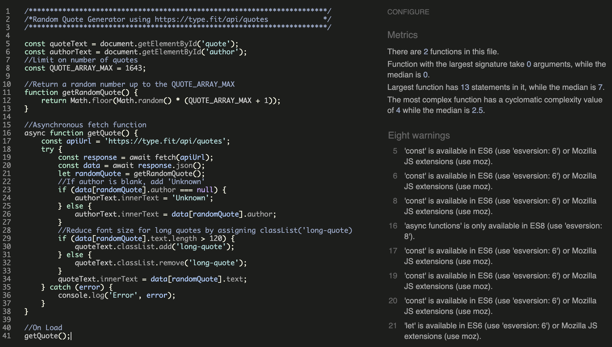
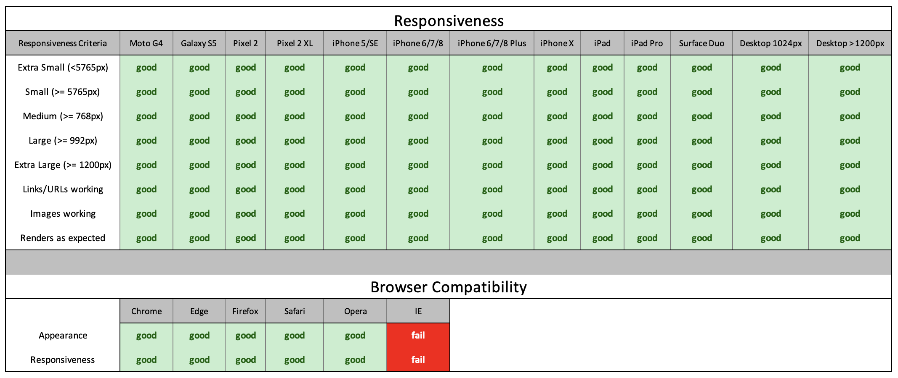
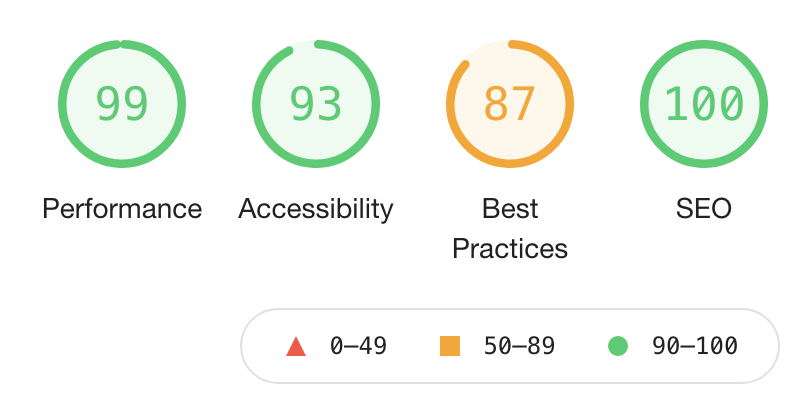
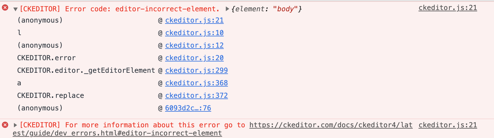

# Testing <!-- omit in toc -->

## Table of Contents
- [HTML Validator](#html-validator)
  - [W3C HTML Markup Validation Service](#w3c-html-markup-validation-service)
- [CSS Validator](#css-validator)
  - [W3C CSS Validation Service](#w3c-css-validation-service)
- [JavaScript](#javascript)
  - [JSHint](#jshint)
- [Compatability](#compatability)
  - [Manual Testing](#manual-testing)
  - [Automated Testing](#automated-testing)
    - [Chrome Dev Tools - Lighthouse](#chrome-dev-tools---lighthouse)
- [User Stories](#user-stories)
- [Bugs](#bugs)
  - [1. Bug: xxx #55](#1-bug-xxx-55)

 

# HTML Validator

## [W3C HTML Markup Validation Service](https://validator.w3.org/)

 

- [Home Page (index.html)](https://github.com/leithdm/medium-bloggy/blob/master/templates/index.html)
- [Create Post (create_post.html)](https://github.com/leithdm/medium-bloggy/blob/master/templates/create_post.html)
- [Footer (footer.html)](https://github.com/leithdm/medium-bloggy/blob/master/templates/footer.html)
- [Header (header.html)](https://github.com/leithdm/medium-bloggy/blob/master/templates/header.html)  
- [Login (login.html)](https://github.com/leithdm/medium-bloggy/blob/master/templates/login.html)
- [Post (post.html)](https://github.com/leithdm/medium-bloggy/blob/master/templates/post.html)
- [Profile (profile.html)](https://github.com/leithdm/medium-bloggy/blob/master/templates/profile.html)
- [Register (register.html)](https://github.com/leithdm/medium-bloggy/blob/master/templates/register.html)

 

**Result:** the W3C Validator for HTML does not understand the Jinja templating syntax, therefore shows repeat Errors. 
See sample output below for `index.html`. 
Aside from the Jinja warnings and errors, all other code is valid for each of the .html pages listed above. 

----------

 

# CSS Validator

## [W3C CSS Validation Service](https://jigsaw.w3.org/css-validator/)

 

**Result:** No Errors, 6 warnings.

 

----------

# JavaScript

- File: [script.js](https://github.com/leithdm/medium-bloggy/blob/master/static/js/script.js)

**Result:** This code passed through [JSHint](https://jshint.com/) without any errors. 

I was able to leverage Bootstrap to provide most of the JavaScript functionality on this site. 
However, the following code was also added to `footer.html` in order to print the current year for Copyright purposes. 

``

**Result:** This code passed through [JSHint](https://jshint.com/) without any errors. 

 

----------

# Python

[PEP8 Online](http://pep8online.com/)

**Result:** All .py files are PEP8 compliant. 

 

----------

# Compatability and Responsiveness

## Manual Testing

- Browser compatability: To ensure a broad range of users can successfully use this site, it was manually tested across 
  the 6 major browsers:

  - Chrome v.87
  - Edge v.85
  - Firefox v.81
  - Safari v.12
  - Opera v.71
  - Internet Explorer v.6-11 (tested via [BrowserStack](https://www.browserstack.com/test-in-internet-explorer)).
  

- Site responsiveness was tested using [Chrome DevTools](https://developers.google.com/web/tools/chrome-devtools) using 
  profiles for a wide variety of devices.

- Physical Devices tested included:
  - iPhone 5 (iOS: 12.4.9)
  - iPhone 6 (iOS: 12.4.9)
  - Samsung Galaxy A10 (Model SM-A105FN, Build/QP1A, on Android 10)
  - MacBook Pro (Retina, 13", Late 2013, OS Catalina)
  - Apple iMac 27" (also running Windows 10 Pro ver. 2004, OS 19041.630)

 

**Result:** Both browser compatability and site responsiveness testing can be summarised in the table below. 
Responsiveness was good on all of the devices listed, both physical and simulated. Brower compatability was good across 
all the major browsers, except for Internet Explorer 6-11.

 

----------

## Functionality, Usability, Data Management

I created a comprehensive Testing Document to assess site functionality, usability and data management which can be viewed 
as a PDF **[here](static/testing/manual-testing-procedure.pdf).**

**Overview of Testing Procedure:**
1. Testing Account Creation and Log in.
2. Testing Create, Read, Update, Delete of Blog Posts.
3. Testing Create, Read, Delete of Blog Post Comments.
4. Testing 404, 403, 500 Errors.
5. Testing URL Protection.
6. Testing Search Functionality. 

**Result:** Site performed as expected. Please see the Testing Document referenced above. 

 

----------

### Chrome Dev Tools - Lighthouse

Automated testing was performed using [Chrome Dev Tools - Lighthouse](https://developers.google.com/web/tools/lighthouse). 
Lighthouse is an open-source, automated tool for improving the quality of web pages. It performs audits under 
the following headers:
1. Performance
2. Accessibility
3. Best Practices
4. SEO

**Result:** see summary results below for **Desktop *index.html***. 
- For *Best Practices* x5 insecure requests were found as the site does not use HTTPs. As that is not within the remit
of this project, these warnings were ignored. 

 

**Recommendations:** Performance improvements are recommended in the following areas:

**Conclusion:** As the project is sitting at 99% performance on Desktop, and 95% on Mobile, the suggestions are 
taken under advisement, but are not implemented at this point in time.

 

----------

# User Stories

**Result:** The majority of user stories have been successfully implemented, with a :white_check_mark: to denote items that 
have been implemented. User stories related to an adminstrator account have been pushed into a later sprint. 

 

"**__As a *non-registered user*, I__** ______________________________________________"

- :white_check_mark: should be presented with blog article on the main page.
- :white_check_mark: should be able to click on an article on the main page to read more about it.
- :white_check_mark: should be able to search through articles.
- :white_check_mark: should be able to register an account with the site in order to publish articles, and 
  comment on them.

 

"**__As a *registered user*, I__** ______________________________________________"

- :white_check_mark: should be able to login to the site in order to publish articles.
- :white_check_mark: should be presented with a profile page showing all of my posts.
- :white_check_mark: should be able to update and delete posts from my profile page.
- :white_check_mark: should be able to create comments on any other posts.
- :white_check_mark: should be able to delete comments that I have made.
- :white_check_mark: should be able to logout of my account.

 

----------

# Bugs

## 1. Bug: [CKEDITOR: editor-incorrect-element.](https://ckeditor.com/docs/ckeditor4/latest/guide/dev_errors.html#editor-incorrect-element)

- This bug was noticed in the console was navigating to a page that had a CKEditor Form element. 
- It is worth noting that the CKEditor form works fine, and is fully operational, despite the error.
- One suggestion from the CKEditor docs was to check if the passed argument points to the correct element. 
  I confirmed that it was, and also tried renaming the variable.
- Another suggested solution from [stackoverflow](https://stackoverflow.com/questions/62426969/ckeditor-4-not-working-due-to-error-editor-incorrect-element)
was to create a *dummy* `textarea` element and then initialize the editor after the declaration of the `textarea` element.
- The bug did has not impacted functionality, but investigation is still ongoing.  

[Go back to README.md file](README.md).

